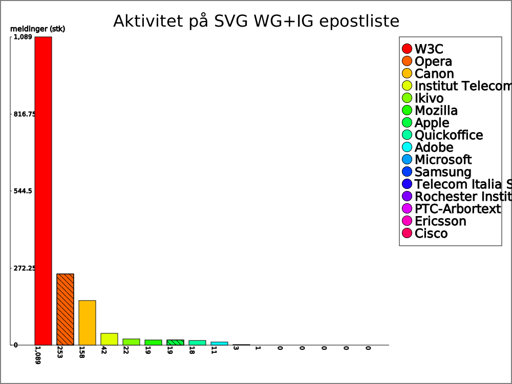

### Medlemmer i SVG Working Group ###

De følgende institusjoner er registrert med et eller flere [medlemmer i
SVG Working Group (WG) pr. 7. mars 2010][1].

 * Adobe Systems Inc.
 * Apple, Inc.
 * Canon, Inc.
 * Cisco
 * ERICSSON
 * Ikivo AB
 * INSTITUT TELECOM
 * Microsoft Corporation
 * Mozilla Foundation
 * Opera Software
 * PTC-Arbortext
 * Quickoffice Inc
 * Rochester Institute of Technology
 * Samsung Electronics Co., Ltd.
 * Telecom Italia SpA

Ved å analysere epost-listene [public-svg-wg][2] og [public-svg-ig][3]
kommer vi frem til følgende oversikt over aktivitet fra de forskjellige
medlemsorganisasjoner:

| Organisasjon                      | Ant. meld. til WG+IG | Andel |
|-----------------------------------|----------------------|-------|
| W3C                               |                 1089 |   66% |
| Opera                             |                  253 |   15% |
| Canon                             |                  158 |    9% |
| Institut Telecom                  |                   42 |    2% |
| Ikivo                             |                   22 |    1% |
| Mozilla                           |                   19 |    1% |
| Apple                             |                   19 |    1% |
| Quickoffice                       |                   18 |    1% |
| Adobe                             |                   11 |    0% |
| Microsoft                         |                    3 |    0% |
| Samsung                           |                    1 |    0% |
| Telecom Italia SpA                |                    0 |    0% |
| Rochester Institute of Technology |                    0 |    0% |
| PTC-Arbortext                     |                    0 |    0% |
| Ericsson                          |                    0 |    0% |
| Cisco                             |                    0 |    0% |

Dessverre ble epost-listene til SVG WG [først gjort offentlig i 2008][4],
noe som fører til at denne oversikten over aktivitet ikke gjenspeiler en
helhetlig oversikt over all kommunikasjon som har forekommet internt i SVG
WG, men kun for de siste to årene. Det er uansett interessant å se på disse
dataene, da de gjenspeiler interesse fra de forskjellige organisasjonene som
står som medlemmer.

Det som umiddelbart viser seg er at W3C internt står for mesteparten av
aktiviteten rundt standardiseringsarbeidet, hele 2/3 av all aktiviteten i
perioden tallene er hentet fra.

Opera viser seg som den mest aktive nettleser-leverandøren med 15%
aktivitet. Deres fokus på SVG gjenspeiler seg også i kvaliteten på deres
implementasjon av SVG i deres nettleser, noe som blir mer omtalt i kapittel
2. Mozilla, Apple og Microsoft derimot viser ikke altfor stor aktivitet i
gruppen, noe som igjen kan gjenspeiles i deres implementasjoner (mer
informasjon om forskjeller i implementasjonene omtales i kapittel 2).

Canon viser et ganske høyt aktivitetsnivå, noe som overrasker, siden de er
et firma som hovedsaklig baserer seg på produkter som driver med
raster-teknologi (fotografi og utskrift). Adobe, som også driver med
grafiske applikasjoner, viser helt klart et lavere aktivitetsnivå, noe som
kan bety at de ikke er fullt så fokusert på standardisering pga. deres høye
markedsandel i deres segment.

[Institut Télécom][5] er et firma som driver med trening og utdanning av
fagpersoner innen telekom-sektoren. Deres aktivitet viser at de er
interessert i åpne standarder, og at vektorisert grafikk er et viktig område
også for telekom-sektoren. [Ikivo AB][6] er et selskap som fokuserer på
multimediale applikasjoner for mobile enheter. Deres aktivitet viser at de
ser på SVG som en viktig standard for mobile enheter. De fremhever spesifikt
på [sin informasjonsside][7] at de benytter SVG Mobile 1.2 og andre åpne
standarder i deres *Enrich*-produkter.

De resterende medlemmene viser liten til ingen aktivitet i arbeidsgruppen,
noe som kan bety at de ikke interesserer seg fullt så mye for videre
utbedring av SVG-standarden, eller at de benytter andre måter å kommunisere
med de andre medlemmene i arbeidsgruppen.

Som [vår epost til SVG WG][4] viser, har vi prøvd å få tak i mer informasjon
om aktiviteten før 2008, men foreløpig (2010-01-04) er det uvisst hvorvidt
vi vil få tilgang til disse opplysningene. Hvis vi får opplysningene kan vi
gjøre en større analyse av aktiviteten internt i arbeidsgruppen for å se
hvilke organisasjoner som har bidratt mest til at standarden har utviklet
seg. Hvis ikke vi får disse opplysningene må vi basere våre funn på de
offentlige dataene gjengitt ovenfor.

[1]: http://www.w3.org/2000/09/dbwg/details?group=19480&public=1&gs=1& "SVG Working Group Participants"
[2]: http://lists.w3.org/Archives/Public/public-svg-wg/ "SVG Working Group public mailing list archive, extracted 2010-04-01"
[3]: http://lists.w3.org/Archives/Public/public-svg-ig/ "SVG Interest Group public mailing list archive, extracted 2010-04-01"
[4]: #w3creply2010-03-08 "Information directly from Doug Schepers, W3C SVG WG Team Contact, dated 2010-03-08"
[5]: http://www.institut-telecom.fr/p_en_present_inst_36.html "Institut Télécom about page"
[6]: http://www.ikivo.com/04about.html "Ikivo AB about page"
[7]: http://www.ikivo.com/open_standards.html "Ikivo - Based on open standards"
