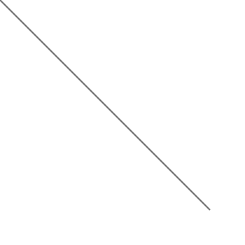
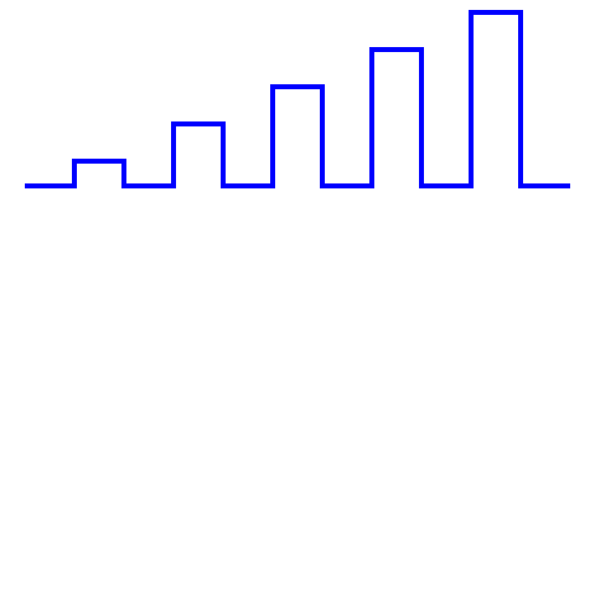
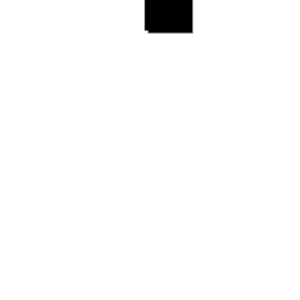

### 1.4 Hvordan ser SVG ut? ###

Som tidligere nevnt er SVG en applikasjon i XML. Det betyr at SVG dokumenter
er beskrevet som XML-kode. For at programmer skal skjønne at man jobber med
SVG og ikke en generisk form for XML må man sørge for å spesifisere et [XML
namespace][1] som identifiserer SVG. SVG sitt namespace er definert som
`http://www.w3.org/2000/svg` i [SVG versjon 1.1][2]. For at nettlesere og
andre enheter som benytter HTTP skal kunne identifisere SVG uten å måtte
dekode dokumentet bør man benytte mimetypen `image/svg+xml`, som er
[registrert][3] hos IANA. Hvis XML-dokumentet innholder data fra forskjellige
navnerom kan man benytte den mer generiske mimetypen [`application/xml`][4].
Tradisjonelt blir filer med SVG-data navngitt med .svg eller .svgz (for
komprimert data) som [filendelse][5].

SVG inneholder et sett med primitiver som kan benyttes for å lage komplekse
figurer i likhet med andre systemer for å tegne vektorisert grafikk. I
tillegg støtter den også tekst og vanlig raster-grafikk (bitmaps). I første
omgang skal vi se på hvilke primitiver som er tilgjengelig, senere kommer vi
inn på bruken av tekst og rastergrafikk.

Følgende primitiver er [tilgjengelig][6] (XML-element benyttet i SVG i parentes):

 * Linje (line)
 * Sammenhengende linjer (polyline)
 * Polygon (polygon)
 * Rektangel (rect)
 * Sti (path)
 * Sirkel (circle)
 * Ellipse (ellipse)

Nedenfor vil vi gå gjennom hver enkelt primitiv i detalj. Som man kan se i
eksemplene er det alltid et rot-element med navn `svg` som definerer synlig
område ([viewport][7]) for hele tegneflaten. I tillegg er det her man definerer
hvilken versjon av SVG-standarden man benytter, evt. hvilken SVG-profil man
baserer seg på (`baseProfile`) samt navnerommet, som nevnt over. En ting som
er verdt å merke seg er at ingen av eksemplene spesifiserer `width` eller
`height`, noe som betyr at viewport skal være så stor som overhodet mulig
(dvs. begge verdier har en standard-verdi på 100%).

#### 1.4.1 Linje ####

Under kan man se et eksempel på [line-elementet][8] i SVG.

[% INSERT 'line.svg' | indent %]

Eksempelet viser en linje fra punkt 0,0 (øverst til venstre) til 300,300.
Farge og tykkelse er spesifisert ved hjelp av CSS med attributtene `stroke`
og `stroke-width`. Man bruker tradisjonell CSS-syntax innenfor
style-attributtet, akkurat som i HTML/XHTML. Det man må være oppmerksom på
er at attributtene ikke er de samme som i HTML. Se en oversikt over hvilke
[CSS-attributter som er gyldige for SVG][9].

#### 1.4.2 Sammenhengende linjer ####

Under kan man se et eksempel på [polyline-elementet][10] i SVG.

[% INSERT 'polyline.svg' | indent %]

I dette eksempelet ser vi en linje trukket gjennom et sett med punkter
spesifisert med `points`-attributtet. Vær oppmerksom på at dersom man skal
spesifisere desimaltall for koordinatene _må_ man benytte punktum som
desimalskille, ikke komma. Kommaet skiller mellom X- og Y-koordinatet mens
et eller flere mellomrom skiller mellom koordinatene i listen. Det som også
er verdt å legge merke til er at verdiene for å sette tykkelse og farge er
her spesifisert med presentasjonsattributter istedenfor CSS-verdier via
style-attributtet. Presentasjonsattributter har [lavere rang][11] enn
CSS-verdier, så hvis begge deler er spesifisert får verdiene som er
spesifisert i stilarket prioritet. Fordelen med å bruke stilark er de samme
som i HTML, at man kan samle sammen utseende-definisjoner og gjenbruke de på
mange elementer. Presentasjonsattributtene arver etter samme regler som i
CSS2, men dokumentasjonen for attributtet forteller om det [støtter arv
eller ikke][12]. SVG-verktøy må ikke støtte CSS, så det er verdt å tenke på
at dersom man ønsker et mest mulig kompatibelt dokument, bør man bruke
presentasjonsattributter.

#### 1.4.3 Polygon ####

Under kan man se et eksempel på [polygon-elementet][13] i SVG.

[% INSERT 'polygon.svg' | indent %]

På lik linje med `polyline` benytter man et attributt med navn `points` til
å spesifisere hvilke punkter polygonet skal bestå av. I praksis er et
polygon det samme som en polyline, men etter det siste koordinatet blir det
tegnet en ekstra linje tilbake til første koordinat og hele elementet blir
fylt med spesifisert fyll-farge. Legg merke til at fargene er her
spesifisert med tradisjonelle hex-koder som i HTML.

#### 1.4.4 Rektangel ####

Under kan man se et eksempel på [rect-elementet][14] i SVG.

[% INSERT 'rect.svg' | indent %]

Et rektangel er spesifisert ved å sette `x`, `y`, `width` og `height`
attributter som forventet. Attributtene `rx` og `ry` derimot krever litt mer
forklaring. De gjør det mulig å få runde hjørner på rektangelet. Verdiene
representerer radius i X- og Y-retning for sirkelen som benyttes for å tegne
hjørnet. Dersom ingen av disse er spesifisert får man hjørner med en 90
graders vinkel. Det som er viktig å huske på er at negative verdier for
rx/ry/width/height ikke er tillatt. I dette eksempelet ser man også bruk av
de konstante navnene i CSS for farger, samt bruk av transparens med
`opacity`-attributtet. I dette tilfellet er elementet 50% gjennomskinnelig.

#### 1.4.5 Sti ####

Under kan man se et eksempel på [path-elementet][15] i SVG.

[% INSERT 'path.svg' | indent %]

I dette eksempelet ser man en spiral tegnet opp ved å bruke en rekke
tegneoperasjoner etter hverandre presentert i et kompakt format. En `M`
betyr moveto og setter utgangspunktet for tegneoperasjonen. En `C` betyr
curveto og tegner en bézierkurve fra utgangspunktet gjennom to
kontrollpunkter til destinasjonspunktet. Destinasjonspunktet blir da det nye
utgangspunktet og tegneoperasjonen fortsetter. Det finnes flere [andre
tegneoperasjoner][16] man kan benytte til å tegne en sti som vi ikke omtaler
her. Det som er interessant å legge merke til er at alle de andre
primitivene vi har beskrevet her også kan tegnes ved hjelp av en sti.

#### 1.4.6 Sirkel ####

Under kan man se et eksempel på [circle-elementet][17] i SVG.

[% INSERT 'circle.svg' | indent %]

Dette er et ganske enkelt eksempel som viser en sirkel plassert i senter av
viewport med en radius på 50 punkter. Bruken av prosent-anvisninger følger
samme tankegang som HTML sin boksmodell ved at tallet blir evaluert i
forhold til størrelsen på forelder-elementet.

#### 1.4.7 Ellipse ####

Under kan man se et eksempel på [ellipse-elementet][18] i SVG.

[% INSERT 'ellipse.svg' | indent %]

På lik linje med sirkelen spesifiserer `cx` og `cy` senterpunktet for
tegneoperasjonen. Men det som er spesielt med en ellipse er at radius i X-
og Y-retningen er forskjellige (i motsetning til sirkelen hvor radius er
identisk i X- og Y-retningen). Man må derfor spesifisere både `rx` og `ry`
for å tegne ellipsen. Radius kan heller ikke her være negativ, på lik linje
med rektangelet.

#### 1.4.8 Tekst ####

Under kan man se et eksempel på [text-elementet][19] i SVG.

[% INSERT 'text.svg' | indent %]

Eksempelet viser først en tekst-streng plassert tett opp til venstre kant og
toppen av tegneområdet. Det er valgt en generisk sans-serif skrifttype i en
passende størrelse. Den neste tekst-strengen er plassert 20 piksler lenger
nede på skjermen og benytter en serif skrifttype. I tillegg er det
spesifisert at selve teksten skal animeres fra utgangspunktet til X-posisjon
200 i løpet av 0.5s. Parameteret *freeze* til fill-attributtet betyr at det
animerte elementet skal bli [stående i sluttposisjonen][20] når animasjonen
er ferdig. Vanligvis flytter elementet som er animert seg tilbake til
utgangsposisjonen etter fullført animasjon (fill="remove"). Igjen ser vi
bruk av en enkel sti-spesifikasjon for å beskrive bevegelsen i animasjonen.

#### 1.4.9 Filter ####

Under kan man se et eksempel på bruk av [filtre][21] i SVG.

[% INSERT 'filter.svg' | indent %]

Eksempelet viser flere avanserte metoder i SVG for gjenbruk av definisjoner
uten behov for duplisering. La oss gå gjennom hver del steg for steg.

Det første man legger merke til er at det er lagt til navnerommet for
[XLink][22], noe som gjør det mulig å referere til andre elementer ved hjelp
av URI-referanser. Selv om URI-referansene er interne må man benytte
xlink:href-attributtet for å peke til ressursene.

Det neste vi legger merke til er [`<defs>`-elementet][23]. Dette er et
samlingselement for andre elementer, på lik linje med `<g>`-elementet. Det som
er spesielt med `defs` er at alle definisjonene innenfor elementet ikke
blir tegnet opp umiddelbart. Men siden de kan refereres til senere i
dokumentet gjør det gjenbruk kjapt og enkelt å få til. Hvis vi hopper over
de faktiske definisjonene kan vi se at begge [`<use>`-elementene][24] henviser
til et internt element med id="text".

Hvis vi tar en kikk på `<text>`-elementet innenfor definisjonen ovenfor finner
vi igjen det refererte id-attributtet. Tekst-elementet blir her tegnet opp
to ganger, først en gang med en grå tegnefarge, og deretter med en sort
tegnefarge. Man kan også se at den grå teksten har et filter aktivert. Hvis
ikke filteret hadde vært benyttet ville den sorte teksten tegnet rett over
den grå teksten som da ikke ville blitt synlig. Men siden filteret er
aktivert påvirker det den grå teksten før den tegnes ut. Det er verdt å
legge merke til at href-definisjonen benytter lenkesyntaks fra HTML sitt
`<a>`-element, mens filter-attributtet benytter CSS-syntaks for å referere til
en ressurs.

Hvis vi nå tar en kikk på `<filter>`-elementet innenfor definisjonsblokken ser
vi at filteret består av en [gaussian blur-effekt][25] pluss en
[offset-effekt][26]. Blur-effekten bruker kildegrafikken, utfører en
blur-operasjon på størrelse 2 og lagrer resultatet i en midlertidig buffer
som navngis **blur**. Offset-effekten benytter da denne midlertidige
bufferen som kilde og flytter x- og y-posisjon med 3 piksler. Dette fører da
til at en skygge tegnes i grått først, og sort tekst tegnes over skyggen
avslutningsvis.

#### 1.4.10 Animasjon ####

Under kan man se et eksempel på bruk av [animasjon][27] i SVG.

[% INSERT 'animation.svg' | indent %]

Eksempelet viser et rektangel som omtalt før, men denne gangen med et sett
med animasjonsregler som påvirker fyll-fargen og avrundingen i hjørnene.
Attributtet **attributeName** spesifiserer hvilket attributt på det
omsluttende elementet som skal animeres, og attributtet **attributeType**
spesifiserer om det er et XML-attributt eller et CSS-attributt som skal
animeres. I vårt eksempel animerer vi kun XML-attributter. Først
spesifiserer vi at fyll-fargen skal endres fra rød til gul over en
tidsperiode på 2 sekunder. Når farge-endringen er ferdig skal den bli
stående fordi vi benytter fill="freeze". Deretter har vi to identiske regler
som forteller at rx og ry-attributtene (hjørneradius) skal endres fra
verdien 0 (skarp) til verdien 10 (avrundet) over en periode på 2 sekunder,
men man skal vente 2 sekunder før man starter endringen. I dette tilfellet
skal endringen bli stående igjen etter at animasjonen er ferdig.

[1]: http://www.w3.org/TR/xml-names/ "Namespaces in XML 1.0 (3rd Edition), W3C/Tim Bray/Dave Hollander/Andrew Layman/Richard Tobin/Henry S. Thompson, 2009-12-8"
[2]: http://www.w3.org/TR/SVG11/attindex.html "SVG 1.1 attribute index, W3C, 2003-01-14"
[3]: http://www.w3.org/TR/SVGTiny12/mimereg.html "SVG Tiny 1.2 mimetype registration, W3C, 2008-12-22"
[4]: http://tools.ietf.org/html/rfc3023#section-3.2 "application/xml mimetype registration - XML Media Types, M. Murata/IBM/S. St. Laurent/simonstl.com/D. Kohn/Skymoon Ventures, 2001-01-XX"
[5]: http://www.w3.org/TR/SVG/intro.html#MIMEType "SVG mime type, file name extension, W3C, 2003-01-14"
[6]: http://www.w3.org/TR/SVG11/intro.html#TermShape "SVG 1.1 shape term, W3C, 2003-01-14"
[7]: http://www.w3.org/TR/SVG11/struct.html#SVGElement "SVG 1.1 <svg> element, W3C, 2003-01-14"
[8]: http://www.w3.org/TR/SVG11/shapes.html#LineElement "SVG 1.1 <line> element, W3C, 2003-01-14"
[9]: http://www.w3.org/TR/SVG11/styling.html "SVG 1.1 styling properties, W3C, 2003-01-14"
[10]: http://www.w3.org/TR/SVG11/shapes.html#PolylineElement "SVG 1.1 <polyline> element, W3C, 2003-01-14"
[11]: http://www.w3.org/TR/SVG11/styling.html#UsingPresentationAttributes "SVG 1.1 specifying properties using the presentation attributes, W3C, 2003-01-14"
[12]: http://www.w3.org/TR/SVG11/styling.html#Inheritance "SVG 1.1 styling inheritance rules, W3C, 2003-01-14"
[13]: http://www.w3.org/TR/SVG11/shapes.html#PolygonElement "SVG 1.1 <polygon> element, W3C, 2003-01-14"
[14]: http://www.w3.org/TR/SVG11/shapes.html#RectElement "SVG 1.1 <rect> element, W3C, 2003-01-14"
[15]: http://www.w3.org/TR/SVG11/paths.html#PathElement "SVG 1.1 <path> element, W3C, 2003-01-14"
[16]: http://www.w3.org/TR/SVG11/paths.html#PathData "SVG 1.1 path data, W3C, 2003-01-14"
[17]: http://www.w3.org/TR/SVG11/shapes.html#CircleElement "SVG 1.1 <circle> element, W3C, 2003-01-14"
[18]: http://www.w3.org/TR/SVG11/shapes.html#EllipseElement "SVG 1.1 <ellipse> element, W3C, 2003-01-14"
[19]: http://www.w3.org/TR/SVG11/text.html#TextElement "SVG 1.1 <text> element, W3C, 2003-01-14"
[20]: http://www.w3.org/TR/SVG11/animate.html#TimingAttributes "SVG 1.1 animation timing attributes, W3C, 2003-01-14"
[21]: http://www.w3.org/TR/SVG11/filters.html "SVG 1.1 filter effects, W3C, 2003-01-14"
[22]: http://www.w3.org/TR/xlink/ "XML Linking Language 1.0 W3C Recommendation, W3C/Steve DeRose/Eve Maler/David Orchard, 2001-06-27"
[23]: http://www.w3.org/TR/SVG11/struct.html#DefsElement "SVG 1.1 <defs> element, W3C, 2003-01-14"
[24]: http://www.w3.org/TR/SVG11/struct.html#UseElement "SVG 1.1 <use> element, W3C, 2003-01-14"
[25]: http://www.w3.org/TR/SVG11/filters.html#feGaussianBlur "SVG 1.1 <feGaussianBlur> filter effect, W3C, 2003-01-14"
[26]: http://www.w3.org/TR/SVG11/filters.html#feOffset "SVG 1.1 <feOffset> filter effect, W3C, 2003-01-14"
[27]: http://www.w3.org/TR/SVG11/animate.html "SVG 1.1 animation elements, W3C, 2003-01-14"
